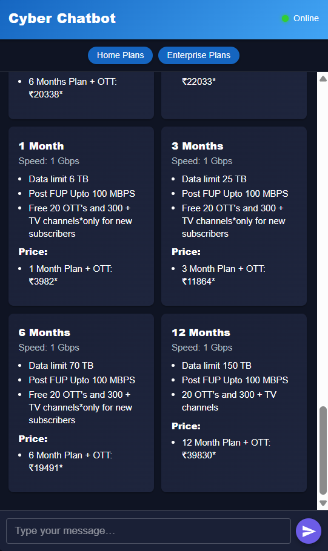

<!-- Live Demo Badge -->
<p align="center">
  <a href="https://final-nine-vert.vercel.app/" target="_blank">
    
  </a>
</p>

# DNA Goa Cyber-Awareness

A modern, interactive web application to promote cyber security awareness, provide real-time threat information, and offer practical tools for users in Goa and beyond.

---

## 🚀 Features

- **Hero Section:** Engaging introduction to the platform.
- **BentoGrid:**  
  - Showcases key services, cyber safety tips, and awareness campaigns.
  - Interactive carousels for cyber attacks, scam awareness, and safety tips.
  - Useful links to government and cyber crime resources.
- **Password Checker & SMS Detector:**  
  - Tools to check password strength and detect suspicious SMS content.
- **Senior & Child Safety:**  
  - Dedicated sections for senior and child cyber safety.
- **Threat Map:**  
  - Real-time visualization of global cyber threats.
- **News Section:**  
  - Latest cybersecurity news and articles.
- **Chatbot:**  
  - AI-powered assistant for FAQs, plan info, and general cyber security queries.
- **Footer:**  
  - Contact info and contributors.

---

## 🖼️ Screenshots

> _Below are screenshots of the main sections. All images are in `public/imgs/`._
>
> ### Cyber Attacks
> 
>
> ### Recent Scams Goa
> 
>
> ### Security Tips
> 
>
> ### Useful Links
> 
>
> ### Tools
> 
>
> ### Threat Map
> 
>
> ### News
> 
>
 ### ChatBot
> 
> _...add more screenshots as needed for each section._

---

## 🛠️ Tech Stack

- **Frontend:** React, Material-UI (MUI), Swiper.js
- **Backend:** Node.js (for news API)
- **Other:**  
  - Custom animations with MUI keyframes
  - Responsive design

---

## 📁 Project Structure

```
final/
  public/
    imgs/                # Images for tips, attacks, etc.
    index.html
  src/
    components/          # All React components
      BentoGrid.js
      Chatbot.js
      ChildSafety.js
      Footer.js
      Hero.js
      Navbar.js
      NewsSection.js
      PasswordChecker.js
      SeniorSafety.js
      SMSDetector.js
      ThreatMap.js
    App.js
    index.js
  api/
    news.js              # News API route
  package.json
```

---

## 🧑‍💻 Getting Started

1. **Clone the repository:**
   ```sh
   git clone https://github.com/AASHVA-bit/final.git
   cd final
   ```

2. **Install dependencies:**
   ```sh
   npm install
   ```

3. **Run the app:**
   ```sh
   npm start
   ```

4. **Open in browser:**  
   Visit [https://final-nine-vert.vercel.app/](https://final-nine-vert.vercel.app/)

---

## 📢 Contributing

Pull requests are welcome! For major changes, please open an issue first to discuss what you would like to change.

---

## 📄 License

MIT License

---

## 🙏 Credits

Developed by: 
- [Rohan](https://github.com/Rohan-Zara)
- [Nirbhay](https://github.com/24nirbhay)
- [Aashva](https://github.com/AASHVA-bit)

---

## 📞 Contact

For queries or support, call: **08326747575**

---
